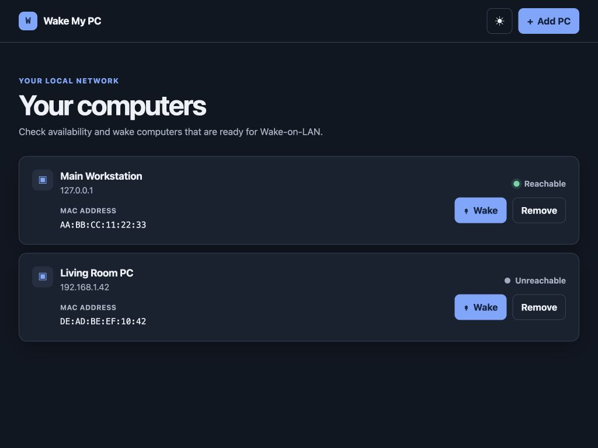

# Wake My PC

A simple, local-first web app for checking whether computers on your LAN are reachable and waking them with Wake-on-LAN. Built with Node.js, TypeScript, Express, HTMX, and a JSON file—no database or cloud service required.



## Why

I often use my computer remotely over VPN, and sometimes I forget to turn it on. Hence, this is the solution.

## Features

- Save computers by IPv4 and MAC address
- Resolve MAC addresses from the local ARP table
- Monitor reachable status with automatic ping checks
- Send Wake-on-LAN packets and watch for the computer to come online
- Responsive light and dark interface
- Runs on Windows, macOS, and Linux

## Setup

### Requirements

- Node.js 24 LTS (Node.js 22 or newer is supported)
- An always-on device on the same IPv4 LAN as the computers being managed
- Wake-on-LAN enabled in each target computer's BIOS/UEFI and network adapter
- The operating system's standard `ping` and ARP tools

### Install and run

```sh
npm install
npm run dev
```

Open [http://localhost:3000](http://localhost:3000), or use the host device's LAN address from another device. Saved computers are written to `data/pcs.json`.

For a production build:

```sh
npm run build
npm start
```

### Configuration

| Variable | Default | Description |
| --- | --- | --- |
| `HOST` | `0.0.0.0` | Address on which the web server listens |
| `PORT` | `3000` | Web server port |
| `DATA_FILE` | `data/pcs.json` | Location of the saved-PC JSON file |
| `WOL_BROADCAST_ADDRESS` | Auto-detected | Optional directed broadcast override, such as `192.168.1.255` |

## Networking notes

- Only IPv4 is supported.
- ARP lookup is best-effort and normally requires the target to be awake and on the same subnet.
- “Unreachable” means the computer did not answer ICMP ping; it does not necessarily mean it is powered off.
- The app has no login and is intended for a trusted LAN. Do not expose it directly to the public internet.
